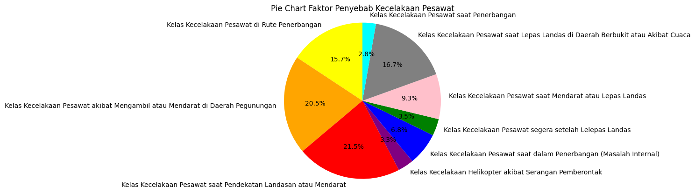

<h1 align="center"> PlaneCrash Detectives </h1>  

  

  Project Mata Kuliah Big Data Tahun 2023

<!-- START doctoc generated TOC please keep comment here to allow auto update -->
<!-- DON'T EDIT THIS SECTION, INSTEAD RE-RUN doctoc TO UPDATE -->
## Table of Contents

- [Kelompok](#kelompok)
- [Introduction](#introduction)
- [Metode](#metode)
<!-- - [Setup](#setup)
- [Running](#running) -->
- [UTS](#uts)
- [UAS](#uas)

<!-- END doctoc generated TOC please keep comment here to allow auto update -->

## Kelompok

Anggota Kelompok 3:

* <a href="https://github.com/haarisahjufri0311">Haarisah Yustika Putri Al-Jufri</a>
* <a href="https://github.com/onynovianti">Ony Novianti</a>
* <a href="https://github.com/renaldi-oss">Reynaldi Fakhri Pratama</a>

## Introduction

Fokus pada proyek ini adalah Mencari Faktor-Faktor Yang Mempengaruhi Kecelakaan Pesawat Di Seluruh Dunia menggunakan dataset yang diambil dari https://www.kaggle.com/datasets/saurograndi/airplane-crashes-since-1908.

## Metode
Untuk penentuan topik, kami menggunakan <b>LDA (Latent Dirichlet Allocation)</b> yaitu algoritma yang umum digunakan untuk pemodelan topik dalam analisis teks. Alasan mengapa LDA sering digunakan untuk penentuan topik adalah karena keunggulannya dalam mengidentifikasi pola topik yang tersembunyi dalam kumpulan dokumen.   
Kami mengimplementasikan <b>SVC (Support Vector Classifier)</b> yang mana model tersebut adalah implementasi dari SVM atau Support Vector Machine. Alasan kami menggunakan model tersebut adalah karena model tersebut kami anggap mampu untuk menangani proses klasifikasi yang akan kami lakukan untuk memprediksi faktor kecelakaan pesawat pada 1 kolom dalam dataset yaitu kolom Summary. 

<!-- ## Setup
Karena pada tugas ini model telah disimpan, maka untuk setupnya download file model yang ada di link berikut :  
<a href="">Link Download Model</a> 
Setelahnya, masukkan file tersebut ke dalam folder model. Dalam contoh ini, berikut letak foldernya :

## Running
Untuk melakukan running, pastikan terlebih dahulu model sudah ada pada lokasi yang diinginkan. Setelah itu jalankan kode pada 
<a href="#"> Notebook</a>
ini. -->

## Hasil
Hasil dari penentuan topik yang kami lakukan adalah sebagai berikut :  

## UTS
### Pandas

<a href="https://github.com/onynovianti/project-big-data-2023/blob/f149a5af407d2706c7d3d20974e85368de04e88d/src/uts.ipynb">Notebook</a>

### PySpark

<a href="https://github.com/onynovianti/project-big-data-2023/blob/f149a5af407d2706c7d3d20974e85368de04e88d/src/uts_spark.ipynb">Notebook</a>

## UAS

### Penentuan Topik atau Kelas Untuk Klasifikasi
<a href="https://github.com/onynovianti/project-big-data-2023/blob/f149a5af407d2706c7d3d20974e85368de04e88d/src/BigData_Penentuan_Topik.ipynb">Notebook</a>

### Klasifikasi Menggunakan SVC
<a href="https://github.com/onynovianti/project-big-data-2023/blob/f149a5af407d2706c7d3d20974e85368de04e88d/src/BigData__SVM.ipynb">Notebook</a>